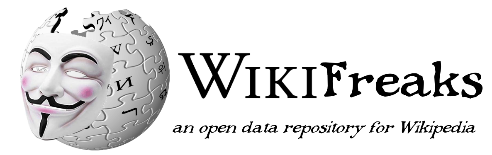

An open repository of Wikipedia data. Final project LIS 546 (Data Curation II) at UW.
  
by Joe Lollo and Lily Woodard
  
To view the full protocol report, please view <a href="https://uw.manifoldapp.org/projects/wikifreaks">our Manifold page</a>. Manifold is a website for publishing digital, open-source books and documents. It is widely used in digital humanities and cultural heritage projects, which is why we chose to feature it there.

## Table of Contents:
- [Introduction and Statement of Work](https://github.com/JoeLollo21/WikiFreaks/blob/main/protocol-report/introduction.md)
- [User Community](https://github.com/JoeLollo21/WikiFreaks/blob/main/protocol-report/user-communities.md)
- [Collection, Ingest, and Deposit Policies](https://github.com/JoeLollo21/WikiFreaks/blob/main/protocol-report/policies.md)
- [Data Transfer and Transformation Policies](https://github.com/JoeLollo21/WikiFreaks/blob/main/protocol-report/policies-2.md)
- [Metadata Application Profile](https://github.com/JoeLollo21/WikiFreaks/blob/main/protocol-report/metadata.md) and [Sample XML Metadata](https://github.com/JoeLollo21/WikiFreaks/blob/main/protocol-report/Sample-Metadata.xml)
- [Licensing Information](https://github.com/JoeLollo21/WikiFreaks/blob/main/protocol-report/licensing.md)
- [Original and Curated Data](https://github.com/JoeLollo21/WikiFreaks/tree/main/sample-data) and [Data Dictionary](https://github.com/JoeLollo21/WikiFreaks/blob/main/sample-data/Sample-Data-Dictionary.csv)
- [Documentation of Conversion and Curation Work](https://github.com/JoeLollo21/WikiFreaks/blob/main/protocol-report/data-conversion.md)
